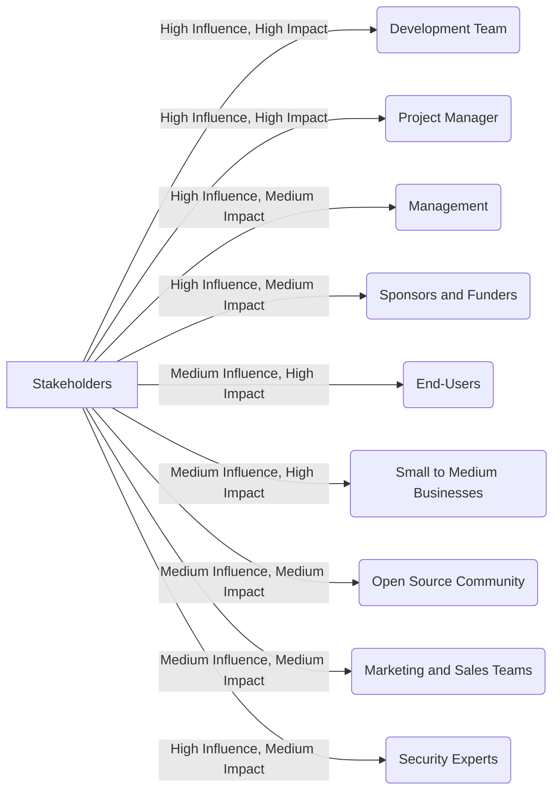

# Stakeholder Analysis: Reactory

## Overview
This stakeholder analysis identifies and categorizes the various stakeholders involved in the Reactory project, assessing their interests, influence, and impact on the project's success. Understanding these aspects will help in managing stakeholder expectations and ensuring effective communication throughout the project lifecycle.

## Stakeholder Influence and Impact Graph

## Stakeholder Categories
1. **Internal Stakeholders**: Individuals or groups within the organization who are directly involved in the project.
2. **External Stakeholders**: Individuals or groups outside the organization who have an interest in the project.

## Stakeholder Identification and Analysis

### 1. Development Team
**Role**: Responsible for designing, developing, and maintaining the Reactory platform.

**Interests**:
- Building a robust, flexible, and cost-effective RAD platform.
- Ensuring the platform meets high standards of quality and usability.
- Receiving feedback to improve the platform continuously.

**Influence**: High

**Impact**: High

### 2. Project Manager
**Role**: Oversees the project, ensuring timely delivery, effective resource management, and alignment with objectives.

**Interests**:
- Meeting project deadlines and staying within budget.
- Coordinating between different stakeholders.
- Ensuring the project's success and stakeholder satisfaction.

**Influence**: High

**Impact**: High

### 3. End-Users (Developers and Organizations)
**Role**: Use the Reactory platform to build and scale applications.

**Interests**:
- Accessing a powerful, flexible, and cost-effective RAD platform.
- Having comprehensive documentation and support.
- Ensuring the platform is easy to use and meets their development needs.

**Influence**: Medium

**Impact**: High

### 4. Management
**Role**: Provides guidance, support, and resources for the project.

**Interests**:
- Ensuring the project aligns with the organization's strategic goals.
- Seeing a return on investment through increased adoption and use.
- Maintaining the project within budget and timelines.

**Influence**: High

**Impact**: Medium

### 5. Open Source Community
**Role**: Contributors and users who help improve and adopt the platform.

**Interests**:
- Contributing to the development and enhancement of the platform.
- Ensuring the platform remains open, collaborative, and community-driven.
- Receiving recognition for their contributions.

**Influence**: Medium

**Impact**: Medium

### 6. Small to Medium Businesses (SMBs)
**Role**: Potential users of the Reactory platform to build and grow their applications.

**Interests**:
- Accessing a cost-effective solution for developing complex applications.
- Ensuring the platform can scale with their business needs.
- Having reliable support and resources.

**Influence**: Medium

**Impact**: High

### 7. Sponsors and Funders
**Role**: Provide financial support for the development and growth of the platform.

**Interests**:
- Ensuring the project delivers value and meets its objectives.
- Seeing a positive return on their investment.
- Maintaining oversight of project progress and outcomes.

**Influence**: High

**Impact**: Medium

### 8. Security Experts
**Role**: Ensure the platform's security measures are robust and effective.

**Interests**:
- Identifying and mitigating security vulnerabilities.
- Ensuring the platform complies with security standards and regulations.
- Maintaining the integrity and trustworthiness of the platform.

**Influence**: Medium

**Impact**: High

### 9. Marketing and Sales Teams
**Role**: Promote and sell the platform to potential users and customers.

**Interests**:
- Highlighting the platform's strengths and benefits.
- Reaching target markets effectively.
- Ensuring customer satisfaction and retention.

**Influence**: Medium

**Impact**: Medium

## Stakeholder Engagement Strategy

### High Influence, High Impact
- **Development Team**
- **Project Manager**
- **Management**

**Strategy**: Regular meetings, detailed progress reports, and active involvement in decision-making processes.

### High Influence, Medium Impact
- **Sponsors and Funders**
- **Security Experts**

**Strategy**: Frequent updates, detailed briefings, and involvement in key project milestones.

### Medium Influence, High Impact
- **End-Users (Developers and Organizations)**
- **Small to Medium Businesses**

**Strategy**: User feedback sessions, beta testing programs, and comprehensive support resources.

### Medium Influence, Medium Impact
- **Open Source Community**
- **Marketing and Sales Teams**

**Strategy**: Community forums, contribution guidelines, marketing campaigns, and regular updates.
