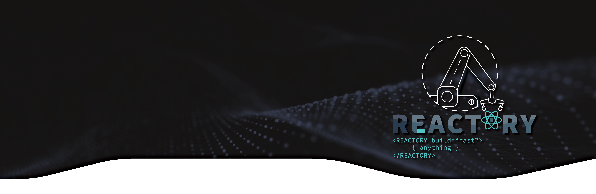
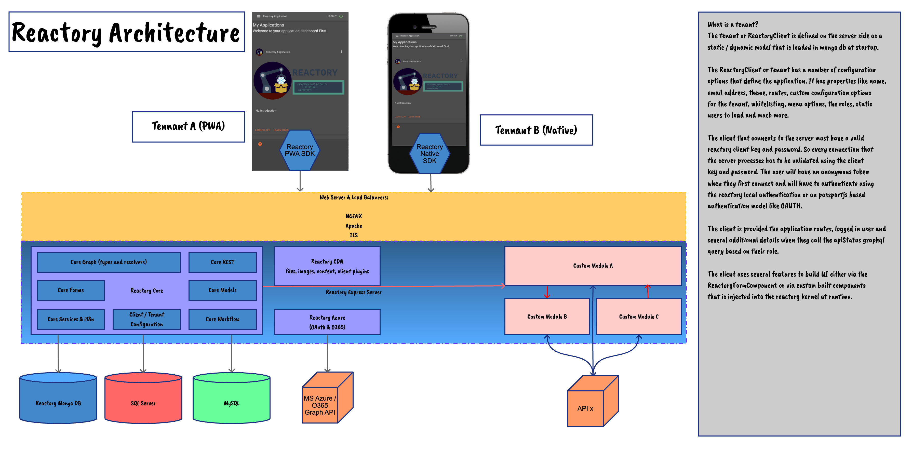

# Reactory Documents
Welcome to Reactory Documents. This is a starting point for your journey with Reactory. This project will only contain documentation, samples and links to resources for further reading. 

*!!Please note, the documentation is a contual work in progress and will rapidly be updated so subscribe to the repo and be on the lookout for new developments.*

## Reactory: A RAD Framework for Enterprise Grade Web and Native React Applications

Reactory is a powerful RAD (Rapid Application Development) framework designed for software engineers to rapidly prototype and develop enterprise-grade web and native React applications. The framework consists of multiple components that work together to provide developers with the tools necessary to create high-quality applications in a fraction of the time it would typically take.

### Three C's Approach: Convention, Configuration, and Customization

Reactory employs a three C's approach to software design that is based on the following principles:

- **Convention**: The system is designed to follow conventions whenever possible. This means that data structures can be interpreted by the system, and the system will provide the best possible interface based on the data structure and metadata.

- **Configuration**: When convention fails to provide the best possible interface, configuration provides extended capabilities for presentation and data acquisition. Developers can configure the system to meet specific needs, enabling them to create custom solutions that are tailored to their unique requirements.

- **Customization**: When neither convention nor configuration can provide the best user interface, full customization is required. Developers can fully customize the system to meet their specific needs, enabling them to create the best possible solution for their project.

### Server and SPA Web Client

Reactory consists of a server and a Single Page Application (SPA) web client that work together to provide a comprehensive solution for enterprise-grade web applications. The server provides the backend infrastructure necessary to support the application, while the SPA web client provides a fast and responsive front-end interface for users.

### React Native Client (Under Construction)

In addition to the server and SPA web client, Reactory is currently under development to include a React Native client. This will provide developers with a comprehensive solution for creating enterprise-grade native applications, as well as web applications.

## Reactory Server: A Highly Configurable and Extensible Express Node.js Application

Reactory Server is an open-source, highly configurable and extensible Express Node.js application designed to provide developers with a comprehensive solution for enterprise-grade web applications. The server comes built-in with core features around multi-tenancy, dynamic user interfaces, users, organizations, business units, memberships with Role Based Access Control (RBAC), teams, theming, plugin and extension, Just In Time (JIT) compilation and distribution of modules, file management, DevOps, workflow, PDF generation, and several other domain areas that are common to most enterprises. The server provides schematic approaches to data fetching, binding, PDF generation, Excel exports, and more.

### Primary API: GraphQL Based API Interaction

The primary API of the Reactory Server is configured for GraphQL based API interaction, and it comes with some REST APIs. Developers can also extend the application with additional REST APIs should they have a need for REST based interaction with some of their components. However, it is recommended to stick to building on top of the graph.

We're adding grpc support in our v1.1.0 release.

### Rich Client Interface Dynamically at Runtime

The server is capable of delivering a rich client interface dynamically at runtime, by using JIT compilation and deployment and auto-recompilation when source modules change. This feature makes it possible for developers to build high-quality applications quickly and efficiently, without compromising on features.

### Multi-Tenancy Support

Reactory Server provides built-in support for multi-tenancy, enabling developers to create applications that can serve multiple organizations with a single instance of the reactory server. 

### Low Overhead and Perfect for Low Budget

The server can be used on its own without the Reactory Client and will function as a customizable and extensible GraphQL API that has a very low overhead. A small 2gb $80/month VM should suffice for up to 100 concurrent users without putting overload on the system. So it is a perfect tool for low budget, without compromising on features.

### Cluster of Domain Applicable Graphs

The server can perform additional graph calls on behalf of the user to other graph services as well as call internal graph calls. This means developers can build a cluster of domain applicable graphs and have them use graph calls on behalf of the users via proxies.

### Reactory Web Client
Reactory Web Client is an open source single-page application built with Create-React-App and based on the React framework. By default, it uses the Material UI or MUI web toolkit, but other view providers such as Bootstrap and Blueprint will be available in future versions.

The client includes a forms engine called ReactoryFormComponent, which can produce complex user interactions by binding a schema to pre-built and custom components. The engine can also be configured to use different component renderers, which makes it ideal for enterprises that require wide accessibility across different devices.

The Reactory Web Client offers most of the features that the native application provides and is recommended as the primary client for Reactory.

## Reactory Native Client

Reactory Native Client is a licensed React Native application that offers the same functionality as the web application but in a mobile app format. However, the app is currently under development and not publicly available.

A free version of the app will be made available on the app store, which can be configured to connect to your API and provide basic features with ads enabled. On the other hand, an enterprise and pro licensed white-labeled version of the app will also be available.

## Benefits of Reactory
Reactory offers several benefits that make it an attractive choice for businesses that require complex features but have limitations on team size or cost of ownership.

One of the primary goals of Reactory is to provide rich features for B2B, B2C, and C2C marketplaces, allowing small to medium enterprises to enjoy the benefits of enterprise software without the high cost of ownership. The platform offers a range of community and commercial licensed modules, providing a comprehensive, one-stop-shop solution.

Built using modern JavaScript / TypeScript, Reactory is highly extensible and configurable, allowing developers to easily customize and add new features to the platform. As a result, there is no need for multidisciplinary teams to maintain different areas of the ecosystem, reducing overhead costs and streamlining development.

In addition to its low cost and easy extensibility, Reactory provides a range of core features that are essential for most enterprises, including multi-tenancy, dynamic user interfaces, user and organization management, RBAC, theming, plugin and extension support, JIT compilation and distribution of modules, file management, devops, workflow, and PDF generation.

Reactory's use of GraphQL as its primary API also makes it highly versatile and easy to use, while its low overhead and ability to function independently of the Reactory Client make it a perfect choice for low-budget applications. Overall, Reactory offers a comprehensive solution for businesses that need advanced features without the high cost of ownership.

### Further Reading
Find a below a list for getting started with Reactory.

* [Installing Reactory](install.md) - Provides links to installation instructions to different modules
* [Developing](development/index.md) - Index page for how tos and links to development docs and tutorials
* [Products](roadmap/products.md) - Overview of all the products that is intended for the system
* [Roadmap](roadmap/overview.md) - The planned roadmap for 2023 / 2024
* [Funding](funding/overview.md) - Interested in being a funder?
* [News](news/index.md) - What's happening

***Disclaimer: The authors of this source code provide it "as is" without warranty of any kind, express or implied, including but not limited to the warranties of merchantability, fitness for a particular purpose, and non-infringement. In no event shall the authors be liable for any claim, damages or other liability, whether in an action of contract, tort or otherwise, arising from, out of or in connection with the software or the use or other dealings in the software. Use at your own risk.***