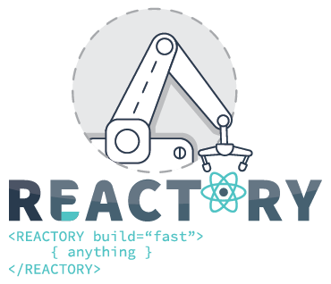

# Core Concepts
At Reactory, we focus on velocity to ensure a quick time-to-market for software development. Our goal is to test software with real users and learn from the assumptions as quickly as possible.

We achieve velocity in several ways:

* **Out-of-the-box features**: Authentication, user management roles, and other basic features are already provided by the platform. Check out the full list of features that come with the core of the application in the `server/modules/core/readme.md`.

* **Reusable modules**: We provide several core services that can be used without having to build from scratch. Our File Service allows for file storage with RBAC abilities, while our Fetch wrappers can execute REST calls on behalf of the user.

* **Schema-generated interfaces**: The Reactory platform provides a schematic approach to creating interfaces and UX.

* **Plugin architecture**: You can mix and match modules to create new components and services.

* **One language**: The platform is built entirely using JavaScript / TypeScript, so no other tools are required.

* **Data mapping**: Our system uses data mapping / inflight data mapping through the object-mapper package. This means that data can be shaped inflight without worrying about complex converters.

To get started, you'll need the following tools on your local machine:

## IDE
We recommend using [VS Code](https://code.visualstudio.com/) as your IDE, but any text editor will work since all tasks are run from the shell.

## Mongo DB
Our core server makes use of MongoDB for data storage. Follow the MongoDB setup found on the server install for more details.

## Node JS
You'll need Node.js 16.x to run the Reactory platform.

