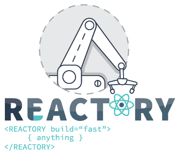

# Installation Guide

Reactory is an open-source, enterprise-grade **Rapid Application Development (RAD) platform** built on Node.js. It gives you multi-tenancy, role-based access control, GraphQL-first APIs, AI-powered workflows, and 40+ composable modules — all on a lightweight, production-ready foundation.

A Reactory environment is made up of a few cooperating repositories:

| Repository | Purpose |
|------------|---------|
| [reactory-express-server](https://github.com/reactorynet/reactory-express-server) | The platform server — Express + GraphQL (Apollo) + MongoDB, module system, workflow engine, CDN |
| [reactory-pwa-client](https://github.com/reactorynet/reactory-pwa-client) | The web client — a React Progressive Web Application (MUI), driven by configuration and the plugin API |
| [reactory-core](https://github.com/reactorynet/reactory-core) | Shared types and definitions, published to npm as `@reactorynet/reactory-core` |
| [reactory-data](https://github.com/reactorynet/reactory-data) | Data / CDN folder structure — themes, plugins, content, assets |
| [reactory-native](https://github.com/reactorynet/reactory-native) | React Native mobile client (optional) |
| [reactory-electron](https://github.com/reactorynet/reactory-electron) | Electron desktop wrapper (optional) |

> **How to use this guide:** The fastest path to a working environment is the **automated installer** below. Use the **manual installation** section if you want full control over every step, or to understand how the pieces fit together. The server repository contains the most detailed, per-task documentation in its own [docs folder](https://github.com/reactorynet/reactory-express-server/tree/master/docs).

---

## Quick Start (Automated Installer)

The fastest way to get a fully configured Reactory environment is the interactive installer shipped with the server. In one guided session it handles system dependencies, Node.js, repository cloning, environment configuration, module selection, and dependency installation for the server, the data/CDN repository, and the PWA client.

### Run the installer remotely

```bash
bash <(curl -fsSL https://raw.githubusercontent.com/reactorynet/reactory-express-server/master/bin/install.sh)
```

### Run the installer locally

If you have already cloned the server repository:

```bash
bash bin/install.sh
```

> **Important:** Use `bash <(curl ...)` (process substitution) rather than piping with `|` so that the interactive prompts can read from your terminal.

### What the installer does

| Step | Description |
|------|-------------|
| **1. System Dependencies** | Detects your OS and package manager (brew, apt, dnf, pacman). Installs git, curl, and the native canvas/PDF libraries (cairo, pango, giflib, etc.). |
| **2. Node.js via nvm** | Installs nvm (if needed), then installs and activates Node 20.19.4. Also installs yarn and env-cmd globally. |
| **3. Repositories** | Prompts for a root directory, then clones the server, PWA client, core types library, and data/CDN repositories. Optionally clones `reactory-native`. Clones the required `reactory-azure` module. Skips any repository that already exists. |
| **4. Shell Environment** | Detects your shell profile (`.zshrc`, `.zprofile`, `.bashrc`) and appends the required `REACTORY_*` exports. |
| **5. Server .env** | Walks you through MongoDB connection, API port, URLs, admin credentials, and more. Generates a complete `.env.<environment>` file with a random `SECRET_SAUCE`. |
| **6. Modules & Clients** | Presents the available modules from `available.json` and lets you select which to enable. Creates the `enabled-<name>.json` and `enabled-clients.<name>.json` files. |
| **7. Build & Install** | Optionally sets up MongoDB via Docker/Podman. Runs `yarn install` in the server and client (note: `reactory-core` is cloned for development purposes, but the build is skipped because `@reactorynet/reactory-core` is installed from npm). |

Every step has sensible defaults and can be skipped. Re-running the installer is safe — it will not overwrite existing clones or configuration files unless you explicitly confirm.

Once the installer finishes, start the server with:

```bash
cd $REACTORY_SERVER
bin/start.sh <config-name> <environment>
```

---

## Manual Installation

If you prefer full control or need to understand each step in detail, follow the manual process below.

### Prerequisites

- **Node.js 20.19.4** — the version the server is maintained on. The `.nvmrc` file in the server repository pins this. We strongly recommend [nvm](https://github.com/nvm-sh/nvm) as your version manager:

  ```bash
  curl -o- https://raw.githubusercontent.com/nvm-sh/nvm/v0.39.7/install.sh | bash
  nvm install 20.19.4
  nvm use 20.19.4
  ```

- **Yarn** — used as the package manager because it supports workspaces/sub-modules natively: `npm install -g yarn`
- **env-cmd** — used for development/environment configuration: `npm install -g env-cmd`
- **MongoDB** — core data storage (see below)
- **Git** and a comfortable command line

> **Windows:** The platform can be run on Windows using Ubuntu on Windows (WSL2). See the [Ubuntu on Windows tutorial](https://ubuntu.com/tutorials/ubuntu-on-windows#1-overview).

### 1. Set your environment variables

The Reactory tooling uses a family of `REACTORY_*` environment variables to locate the repositories and data folders. Add these to your shell profile (`.zshrc`, `.zprofile`, or `.bashrc`):

```bash
export REACTORY_HOME="$HOME/Projects/reactory"
export REACTORY_DATA="$REACTORY_HOME/reactory-data"
export REACTORY_SERVER="$REACTORY_HOME/reactory-express-server"
export REACTORY_CLIENT="$REACTORY_HOME/reactory-pwa-client"
export REACTORY_CORE="$REACTORY_HOME/reactory-core"
export REACTORY_NATIVE="$REACTORY_HOME/reactory-native"
export REACTORY_PLUGINS="$REACTORY_DATA/plugins"
```

Open a new terminal (or `source` your profile) so the variables take effect.

### 2. Install native dependencies (PDF / canvas)

PDF rendering depends on [node-canvas](https://github.com/Automattic/node-canvas) and its native libraries.

**Ubuntu / Linux:**

```bash
sudo apt-get update
sudo apt-get install build-essential libcairo2-dev libpango1.0-dev libjpeg-dev libgif-dev librsvg2-dev
```

**macOS (Homebrew):**

```bash
brew install pkg-config cairo pango libpng jpeg giflib librsvg
```

### 3. Provide a MongoDB instance

Core data is stored in MongoDB via Mongoose. MongoDB is the default, but custom resolvers and plugins can also integrate MySQL, SQL Server, PostgreSQL, Redis, and third-party APIs.

**Docker (recommended for development):**

```bash
docker run -d --name reactory-mongo \
  -p 27017:27017 \
  -e MONGO_INITDB_ROOT_USERNAME=reactory \
  -e MONGO_INITDB_ROOT_PASSWORD=reactorycore \
  -v reactory-mongo-data:/data/db \
  mongo:7
```

<details>
<summary>Other options</summary>

**Linux:** `sudo apt-get install mongodb`

**macOS:**

```bash
brew tap mongodb/brew
brew install mongodb-community
```

For production, use a hosted MongoDB instance or a dedicated server. The [MongoDB installation docs](https://docs.mongodb.com/manual/installation/) cover all environments. The server also ships `bin/docker-compose.sh` and `bin/podman-compose.sh` for a full containerised stack.
</details>

### 4. Check out the source code

Create a root `reactory` folder and clone the repositories inside it:

```bash
mkdir -p reactory && cd reactory
git clone git@github.com:reactorynet/reactory-express-server.git ./reactory-express-server/
git clone git@github.com:reactorynet/reactory-pwa-client.git      ./reactory-pwa-client/
git clone git@github.com:reactorynet/reactory-core.git            ./reactory-core/
git clone git@github.com:reactorynet/reactory-data.git            ./reactory-data/
```

Optionally, for native and desktop development:

```bash
git clone git@github.com:reactorynet/reactory-native.git  ./reactory-native/
git clone git@github.com:reactorynet/reactory-electron.git ./reactory-electron/
```

> **Note:** `reactory-core` is published to npm as `@reactorynet/reactory-core`. Clone the repository for development purposes and module definitions, but the local build can be skipped — the npm package is used by the server and client.

### 5. Install the Azure module

The server currently uses Azure AD (Entra ID) via the Azure module for authentication and authorization and has a direct dependency on it:

```bash
cd $REACTORY_SERVER/src/modules/
git clone git@github.com:reactorynet/reactory-azure.git ./reactory-azure/
```

### 6. Configure the server

#### 6a. Environment configuration file

Copy the sample environment file and adjust the values for your instance:

```bash
cp $REACTORY_SERVER/config/reactory/.env.sample $REACTORY_SERVER/config/reactory/.env.local
```

Or generate a new configuration with the helper script:

```bash
bin/addconfig.sh <config-name> <environment>
```

A minimal `.env` looks like this:

```bash
# The root data folder for the server
APP_DATA_ROOT=$REACTORY_DATA
# The system fonts folder - required by the PDF engine
APP_SYSTEM_FONTS=/usr/share/fonts
# MongoDB connection string (no credentials in the string - see MONGO_USER/MONGO_PASSWORD)
MONGOOSE=mongodb://localhost:27017/reactory
# The name portion of the json used to generate the module __index.ts file
MODULES_ENABLED=
# <CLIENTS_FILENAME> used to generate the clients __index.ts file
CLIENTS_ENABLED=
# The port the server will run on
API_PORT=4000
# The sendgrid api key used for sending emails
SENDGRID_API_KEY=SG.YourKeyDataHere
# The root url of the server (production: https://yourdomain.com)
API_URI_ROOT=http://localhost:4000
# The CDN root url (production: https://yourdomain.com/cdn/)
CDN_ROOT=http://localhost:4000/cdn/
# A secret key used for session and jwt tokens
SECRET_SAUCE=YOUR_SECRET_KEY
# The development mode flag
MODE=DEVELOP
# The mongo user / password (NOT embedded in the MONGOOSE connection string)
MONGO_USER=mongouser
MONGO_PASSWORD=mongopwd
# OAuth / Azure AD
OAUTH_APP_ID=
OAUTH_APP_PASSWORD=
OAUTH_REDIRECT_URI=http://localhost:4000/auth/microsoft/openid/complete/reactory
OAUTH_SCOPES='profile offline_access user.read calendars.read mail.read email'
OAUTH_AUTHORITY=https://login.microsoftonline.com/common
OAUTH_ID_METADATA=/v2.0/.well-known/openid-configuration
OAUTH_AUTHORIZE_ENDPOINT=/oauth2/v2.0/authorize
OAUTH_TOKEN_ENDPOINT=/oauth2/v2.0/token
# Optional email redirect for local development
MAIL_REDIRECT_ENABLED=development,production
MAIL_REDIRECT_ADDRESS=your-email+redirect@gmail.com
```

> **Security:** `.env` files contain secrets and are git-ignored by default. Never commit them.

#### 6b. Select the modules to enable

The server loads modules listed in an `enabled-*.json` file found under `src/modules/`. The simplest approach is to start from the published catalogue:

```bash
cd $REACTORY_SERVER
cp src/modules/available.json src/modules/enabled.json
```

Edit `enabled.json` to enable or disable modules (and to add your own). The `MODULES_ENABLED` variable in your `.env` lets you select a specific file (filename only, no extension) — e.g. `MODULES_ENABLED=my_custom_module_file` loads `src/modules/my_custom_module_file.json`. This makes it easy to run multiple configurations from a single source tree.

Custom modules can be cloned into `src/modules/` as long as they provide an index file that exports the module definition.

#### 6c. Register client / tenant configurations

Applications (clients/tenants) are loaded into the database from the `src/data/clientConfigs/` folder using an `enabled-clients.*.json` file — a simple string array of the client folder names to include:

```bash
echo ["MyApp"] > $REACTORY_SERVER/src/data/clientConfigs/enabled-clients.myapp.json
```

Set `CLIENTS_ENABLED=myapp` in your `.env` to use it. (There is no other way to load client configurations — no API or script exists for this.)

### 7. Install dependencies and start the PWA client

```bash
cd $REACTORY_CLIENT
yarn install
yarn start
```

The client is configuration-driven and talks to the server's GraphQL API. Its own [README](https://github.com/reactorynet/reactory-pwa-client) covers theming, plugins, and build/deploy in detail.

---

## Running the Platform

### Development

```bash
cd $REACTORY_SERVER
bin/start.sh <config-name> <environment>
```

`<config-name>` is the folder under `config/` that contains `.env.<environment>`. Running the command with no parameters defaults to `reactory` / `local`. Useful variants:

| Script | Purpose |
|--------|---------|
| `bin/start.sh` | Start a local development server |
| `bin/debug.sh` | Start with a Node debugger attached |
| `bin/serve.sh` | Start in production mode via pm2 |
| `bin/depends.sh` | Manage yarn dependencies for a configuration |
| `bin/generate.sh` | Run the code generation process |
| `bin/addconfig.sh` | Create a new environment configuration file |
| `bin/git-manager.sh` | Manage all Reactory git repositories at once |
| `bin/docker-compose.sh` / `bin/podman-compose.sh` | Start containerised services |
| `bin/backup.sh` / `bin/restore2.sh` | Back up / restore a MongoDB instance |
| `bin/install.sh` | Interactive guided installer for the full platform |

See the server's [bin/README](https://github.com/reactorynet/reactory-express-server/blob/master/bin/README.MD) for the full script reference.

### Production

A production setup is a standard Linux service:

1. Create a dedicated user (e.g. `sudo adduser -d /var/reactory -m reactory`) with minimal permissions, and make it the owner of the application folders.
2. Check out the code and run `bin/install.sh` (or follow the manual steps above).
3. Ensure a valid `.env` file exists under `config/<config-name>/`.
4. Start the server with `bin/serve.sh` — this runs it in production mode under pm2.
5. Install pm2 (or register the provided service definition) so the server runs as a system service, and set up PM2 monitoring.

The server is lightweight: a small 2 GB VM comfortably serves up to ~100 concurrent users.

---

## Common Issues

### The server is not starting

- Ensure you have a valid `.env` file in the `config/<config-name>` folder.
- Ensure your MongoDB server is running and reachable.
- Ensure the `MONGO_USER` / `MONGO_PASSWORD` values are correct — **do not** embed credentials in the `MONGOOSE` connection string.
- Ensure the `enabled-*.json` module file referenced by `MODULES_ENABLED` exists in `src/modules/`.
- Ensure the `enabled-clients.*.json` file referenced by `CLIENTS_ENABLED` exists in `src/data/clientConfigs/`.

---

## Further Reading

- [What is Reactory?](README.md) — the platform overview, architecture, and the Three C's approach
- [reactory-express-server docs](https://github.com/reactorynet/reactory-express-server/tree/master/docs) — the most detailed, per-task server guide (development, GraphQL, modules, workflows)
- [reactory-pwa-client](https://github.com/reactorynet/reactory-pwa-client) — client installation, theming, and the plugin API
- [Developing](development/index.md) — how-tos and links to development docs and tutorials
- [Products](roadmap/products.md) — overview of the product ecosystem
- [Roadmap](roadmap/overview.md) — where the platform is heading
