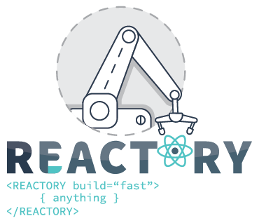

# Product Roadmap
This document will describe the various products, their current versions and their roadmap. 

## Core Products
1. **Reactory Server** - Community version is provided open source. - **Version 1.0.0 RC1.**
   Consists of core functionality: User and user management, Organization and organization management, teams, tasks and projects and tooling around forms.
2. **Reactory Web Client** - Version 1.0.0 RC1. Community version provided open source. 
   Consists of the core client that is themeable and loads theme, menus, navigation etc from the backend application that it is connecting to.
3. **Reactory Native** - Alpha in progress
4. **Reactory IoT** - In research phase

### Server Extensions and Client Plugins
1. **Reactory Azure** - Basic Azure Integration, provides login and basic office 365 integration - ***Version 1.0.0 RC1***
2. **Reactory Azure Enterprise** - Provides full MS Office 365 integration, Forms, Graph and Samples - ***Under Development*** 
3. **Reactory CRM**  - CRM features, clients, product management, quotes and invoice generation. - ***Alpha, Beta refactor in progress***.
4. **Reactory CRM Enterprise** - Automated workflow, client portal. - ***Research***
5. **Reactory AWS** - AWS integration for devops and self application management - ***Research***
6. **Reactory Blog** - Free Blogging Module that provides basic blogging and commenting. - ***Under Development***
7. **Reactory Code** - A module that provides code generations features. Useful for large enterprise. Provides schema / connectors to code conversions to auto generate interfaces for databases or APIs. - ***Under Development***
8. **Reactory DevOps** - Provides basic devops features for small to medium applications - ***Research***
9. **Reactory DevOps Enterprise** - Provides enterprise grade devops to manage stacks like aws or similar. - Research
10. **Reactory MySQL** - Provides graph and forms for running queries against configured mysql databases - ***Alpha***
11. **Reactory SQL Server** - Provides graph and forms for running queries against configured sql server databases - ***Alpha***
12. **Reactory R** - Provides graph and forms for executing R models - ***Research***
13. **Reactory Search** - Provides graph and forms for configuring and serving search results using the internal search provider for Reactory - default engine uses Elastic Search - ***Research***
14. **Reactory MQTT** - Provides MQTT functionality for IoT devices as well as the Graph and Forms for reviewing / interacting with IoT devices. - ***Research***
15. **Reactory Social** - Provides Graph, forms and services for various twitter, facebook and linkedin API interactions - ***Research***
16. **Reactory Google** - Provides Graph, forms and services for various google API interactions - ***Research***
17. **Reactory AI** - Provides Graph, forms and services for interacting with various AI services - ***Alpha***
18. **Reactory Trace** - Provides Graph, forms and services to view traces generated by the system and associated graphs. - ***Research***
19. **Reactory PDF** - Provides Graph, forms and services to process PDF requests.  Enterprise version will provide additional features like sharing, permission based access, searching and cataloging of uploaded PDF docments - ***Beta*** 
20. **Reactory Demographics** - Provides Graph, forms and Services to manage customizable user demographics - ***Alpha***
21. **Reactory Mapping** - Provides Graphs, forms and Services for map related functions. Integrated with Google and Bing maps. ***Research***
22. **Reactory Manufacture** - Provides Graphs, forms and Services for manufacturing related functions. - ***Research***
23. **Reactory Stream** - Provides Graphs, forms and Services for capturing, sharing and piping compressed binary data streams. ***Research***
24. **Reactory Avatar** - Provides the ability to aquire user captured images and provide the ability to overlay the user on a digital avatar (faceswap)
25. **Reactory Motion** - Modules for motion control and detection. This will cover server side graphs and forms to manage motion settings, flight controls, waypoints and upload to IoT devices / automated drones via the Reactory MQTT toolchain.
26. **Reactory Drone** - Module can receive and send drone flight instructions over a graph api. Intended to run on reactory server instances that run on micro computers like Raspberry Pi
## Partner Products
These are products that have been developed with partners and could be made available as licensed components within a business.
1. **Reactory Reshuffle** - Server module and plugins that provides project management and forecasting solutions with integration into Harvest and automated workflow. (ALPHA)
2. **Reactory Survey** - Server and plugins for running leadership and staff development surveys. Supports team and individual style surveys with a focus on staff development and performance management.  